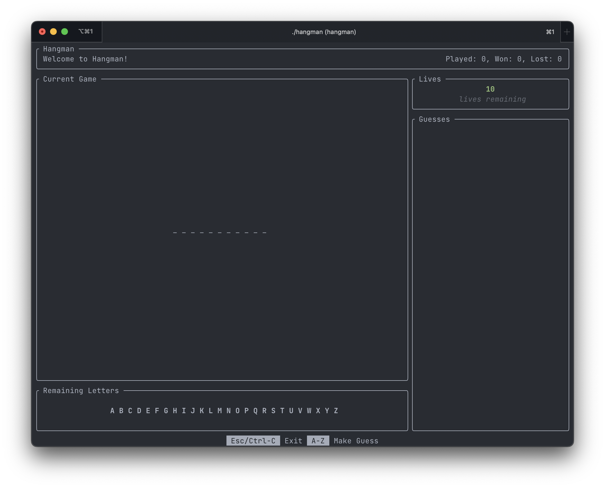
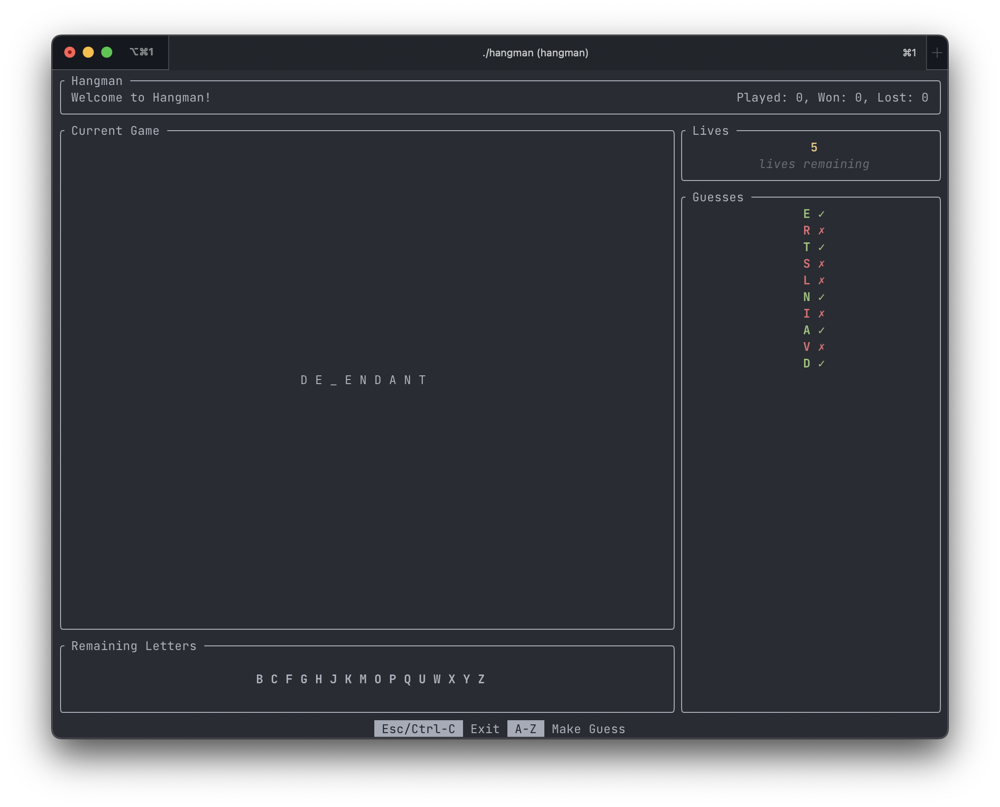
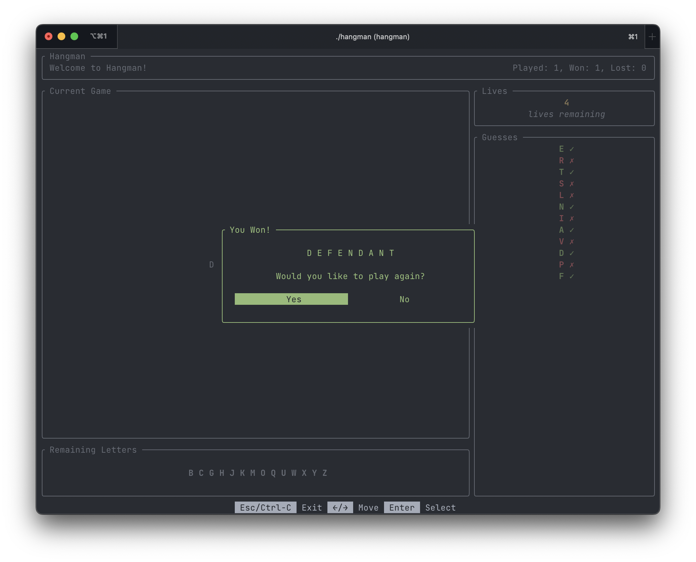
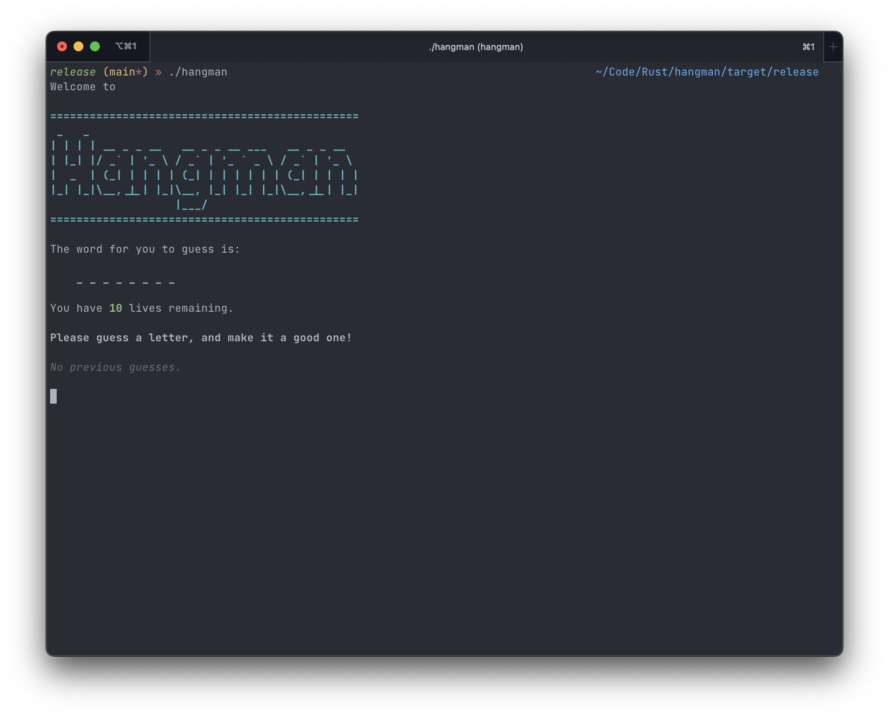

# Hangman

My first program written in Rust.

## Rules

- You get **10** lives.
- You will be shown a blanked out word and asked to guess a letter from the word.
- If your guess is incorrect, you lose a life.
- If your lives hit **0**, you lose the game.
- If you guess all the letters in the word, you win the game.

## Playing the game

### Prerequisites

- Rust

### Running the game

##### Ratatui game runner (default)

```
cargo run
```







#### Stdio game runner (original)

```
cargo run --no-default-features --features "stdio_game_runner"
```



## Using a custom word list

You can replace the [words list](src/game/words.txt) with a custom words list.

_Note: you will need to rebuild the game to see this take effect._

### Example lists

- [https://www.mit.edu/~ecprice/wordlist.10000](https://www.mit.edu/~ecprice/wordlist.10000)
